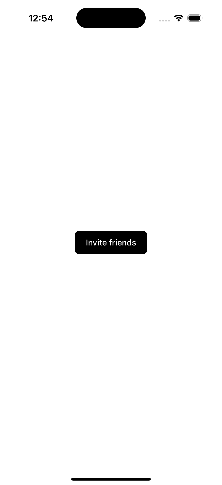
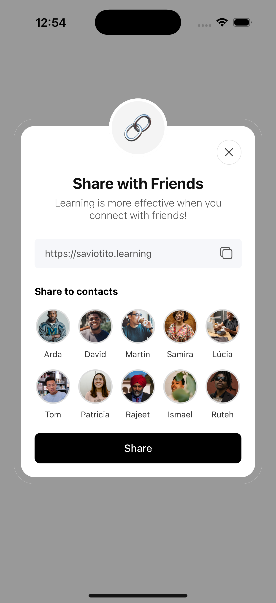
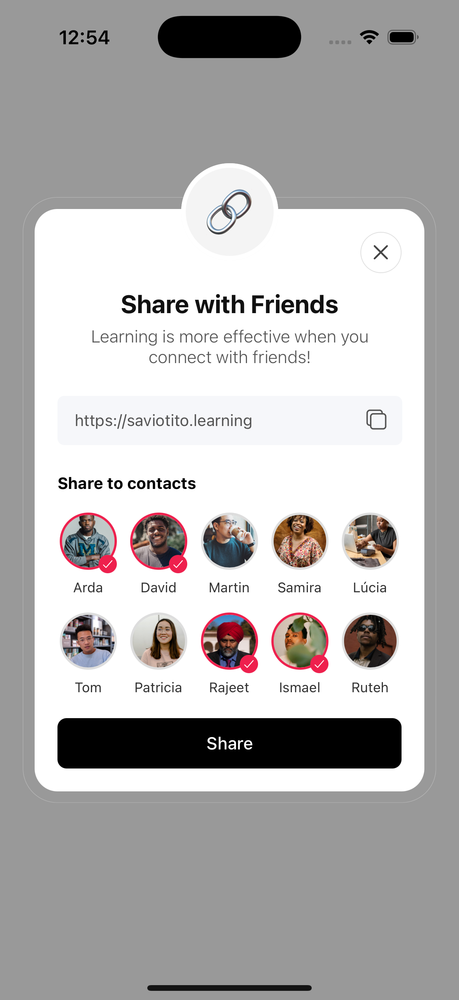

# 📱 React Native Share Component  

A **link-sharing component** for React Native apps (Android & iOS).  
Easily share URLs, messages, or custom text straight from your app using the native share sheet.  

---

## 🚀 Features  
- 📱 Works on **Android & iOS**  
- 🔗 Share **links, text, or both**  
- ⚡ Simple API, ready to plug & play  
- 🎨 Customizable button styling  

---

## 📸 Screenshots  

> Here you go some screenshots of the app, so that you know what to expect:

<p align="center">
  
  
  
</p>


---

## 📦 Installation  

Clone the repository and import the component into your project:  

```bash
git clone https://github.com/SavioTito/MOBILE---Share-Component
```
Then, use the component from the components/ShareDrawer.js file in your project.

## 🛠 Usage  

```jsx
import React, { useState } from "react";
import { View, StyleSheet, Pressable, Text } from "react-native";
import ShareDrawer from "../components/ShareDrawer";

export default function HomeScreen() {
  const [drawerVisible, setDrawerVisible] = useState(false);

  return (
    <View style={styles.container}>
      <Pressable style={styles.btn} onPress={() => setDrawerVisible(true)}>
        <Text style={styles.btnText}>Invite friends</Text>
      </Pressable>

      <ShareDrawer
        visible={drawerVisible}
        onClose={() => setDrawerVisible(false)}
      />
    </View>
  );
}

const styles = StyleSheet.create({
  container: {
    flex: 1,
    justifyContent: "center",
    alignItems: "center",
    backgroundColor: "#fff",
  },
  btn: {
    paddingHorizontal: 20,
    paddingVertical: 12,
    borderRadius: 8,
    backgroundColor: "#000",
  },
  btnText: {
    fontSize: 15,
    color: "#fff",
    fontWeight: "500",
    textAlign: "center",
  },
});
```

## ⚙️ Props  

| Prop       | Type       | Required | Description                                  |
|------------|------------|----------|----------------------------------------------|
| `visible`  | boolean    | ✅        | Controls whether the drawer is open or not   |
| `onClose`  | function   | ✅        | Callback fired when the drawer should close  |


## 🤝 Contributing

Pull requests are welcome. For major changes, please open an issue first to discuss what you’d like to change.

## 📜 License

MIT
